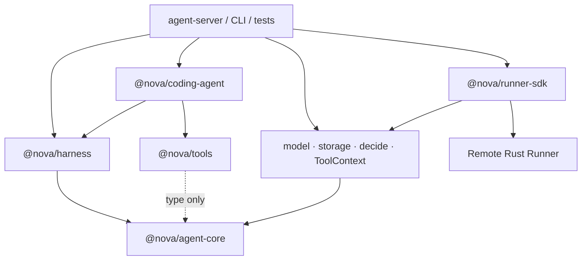

# coding-agent

> 目标包：`packages/coding-agent` — 基于 `agent-core` 的 Coding 场景能力配置。
> 本包已实现；依赖静态组合层 `harness.md`，不定义新的 Agent Runtime。

---

## 1. 结论

Nova **适合抽出 `coding-agent` 层**。

但这里的“层”不是在 `Agent` 外再包一个同名对象，而是一份内聚的 Coding 能力 Module：

> Coding Prompt + 默认代码工具集 + Coding 场景的安全与行为约束。

`agent-core` 的通用职责是“如何运行一个 Agent”；`coding-agent` 的职责是“一个 Coding Agent 默认会什么、遵守什么工作方式”。两者存在真实变化：将来同一套核心循环可以服务 Coding、通用 Chat、研究或其他 Agent，而这些场景不应默认看到 `bash`、文件编辑和 Git Prompt。

因此采用：

```text
agent-core        = 通用运行时语义
harness           = 静态组合机制
coding-agent      = Coding 能力配置
agent-server/CLI  = Provider 与资源的 Composition Root
```

---

## 2. 现状分析

当前 Nova 已经有较好的职责边界：

| 已有能力 | 当前归属 | 判断 |
|---|---|---|
| Turn Loop / Tool Batch | `agent-core` | 保留，所有场景共用 |
| Session / Resume / Compaction | `agent-core` | 保留，所有长会话 Agent 都需要 |
| Decision / Approval | `agent-core` | 保留，是通用执行安全机制 |
| Steering / Follow-up / Next-run | `agent-core` | 保留，是通用交互语义 |
| Sub-agent | `agent-core` | 暂保留；预算与深度属于运行时 |
| `AgentTool` / `ToolContext` | `agent-core` | 保留稳定契约，不因抽层迁移类型 |
| bash / 文件 / grep / git 工具 | `packages/tools` | 保留实现，Coding Module 只选择它们 |
| TODO 状态与保活 | `agent-core` | 保留，语义并不只属于 Coding |
| `todo_write` 实现 | `packages/tools` | 保留；它不访问 FS / OS，只通过结果更新 core 的 TodoState |
| Coding 工作方法 | 目前主要靠基础 Prompt 与 Host 装配 | 应收口到 `coding-agent` |
| 默认代码工具集合 | Host 各自拼装 Tool 数组 | 已由 `coding-agent` 声明 |

### 2.1 当前真正的问题

`createAgent()` 的 `tools` 与 `systemPrompt` 都是显式注入，这是正确的；问题不在 API，而在能力配置缺少唯一 owner：

- `agent-server` 会选择一次默认 Tool 数组；
- 集成测试会再选择一次；
- CLI / SDK 未来还会再选择一次；
- Coding 行为规则可能散落到 `agent-core` 基础 Prompt、Host 和测试夹具；
- 通用 Agent 如果复用同一装配代码，会意外获得代码执行能力。

`coding-agent` 用一份 Module 固化 Coding 能力集合，解决装配分叉。它不改变 `agent-core` 的运行方式。

`packages/tools` 继续作为 Tool 语义的唯一实现包，包括 `todo_write`。这里要区分“Tool 定义放在哪里”和“操作在哪里执行”：文件、操作系统和 Shell Tool 虽然定义在 TypeScript 包中，但绝不在 Node.js 进程本地执行；它们只能经 `ToolContext → runner-sdk → Remote Runner` 完成。`todo_write` 不访问 FS / OS，只返回结构化状态，因此不属于 local execution fallback。

### 2.2 为什么不是 `createCodingAgent()` Wrapper

下面这种 API 不应存在：

```ts
function createCodingAgent(config) {
  return createAgent({ ...config, tools: duplicatedToolList })
}
```

它只是参数转发，且会复制 `Agent` 的构造入口。后续 `fork`、`resume`、Sub-agent 与新配置项都容易出现两套路径。

正确公开面是一份 `AgentModule`，由 Harness 组合，由 `agent-core` 继续创建唯一的 `Agent`。

---

## 3. 定位

**负责**

- Coding 场景的 system prompt 资产；
- Coding 默认 Tool 集合的选择；
- 代码修改前理解、最小变更、验证和结果汇报等行为约束；
- Coding 场景额外的 Tool Guard（只有出现真实策略时才加入）；
- 对外提供唯一的 `codingAgentModule`。

**不负责**

| 不负责 | 归属 |
|---|---|
| Agent Loop / Session / Context / Decision | `agent-core` |
| Module 解析、冲突校验、Observer 隔离 | `harness` |
| Tool 实现 | `packages/tools` |
| Runner / Workspace / Shell 进程 | `crates/runner` / `runner-sdk` |
| 模型选择、Storage、Decide、用户身份 | Host |
| Planning 状态机 / Plan Parser | 不建；TODO + Prompt 已足够 |
| Verification Engine / Test Parser | 不建；`bash` + Prompt + 模型判断 |
| 语言服务器、代码索引、GitHub / Jira | 需要时作为独立 Tool Module 引入 |
| 项目自动识别框架 | 不做；Agent 通过现有读 / 搜索 / 执行工具理解项目 |

---

## 4. 依赖方向



硬约束：

- `agent-core` 不依赖 `coding-agent`；
- `harness` 不依赖任何具体场景 Module；
- `coding-agent` 不直接依赖 `runner-sdk`，避免场景能力认识 gRPC 传输；
- Host 必须使用 `runner-sdk.toToolContext(RunnerSession, ...)` 创建生产 `ToolContext`；
- Coding Tool 只调用 `ToolContext`，FS / OS / Shell 请求最终全部由 Remote Runner 执行；
- `packages/tools` 不运行时 import `agent-core`；
- Host 是唯一同时知道模型、Runner、Storage、Decision 和场景 Module 的地方。

这样通用场景可以直接使用 `agent-core` + Harness 的其他 Module，而不会携带 Coding 依赖。

---

## 5. 对外 API 面

第一版只导出一个值：

```ts
import type { AgentModule } from "@nova/harness"

export const codingAgentModule: AgentModule
```

预期内容：

```ts
export const codingAgentModule: AgentModule = {
  id: "nova.coding-agent",
  tools: [
    readFile,
    grep,
    listDir,
    gitDiff,
    writeFile,
    editFile,
    bash,
    todoWrite,
  ],
  prompts: [
    { name: "coding-workflow", content: CODING_WORKFLOW_PROMPT },
  ],
}
```

不导出：

- `CodingAgent` 类；
- `createCodingAgent()`；
- 第二套 `CodingAgentConfig`；
- Tool Registry；
- Planner / Verifier；
- Workspace / RemoteWorkspace Wrapper；
- 默认 Tool profile 的复制数组。

Module 直接引用 `@nova/tools` 已有 Tool 实例，不复制 Tool schema 或执行逻辑。

---

## 6. Coding Prompt

Coding Prompt 只描述 Coding 场景的行为策略，不重复 `agent-core` 已经用代码保证的状态机。

第一版应覆盖：

### 6.1 先理解后修改

- 实际读取相关文件与调用链，不能根据目录名猜实现；
- 修改前确认现有能力与边界；
- 优先修改现有实现，不创建平行的 V2 / Legacy 路径；
- 保留用户已有改动，不做无关重构。

### 6.2 最小且可验证的变更

- 修改范围与用户目标对齐；
- 先用最窄工具读取，再编辑；
- 改动后运行与风险相称的测试、类型检查或构建；
- 读取实际结果，不把命令启动成功等同于验证通过；
- 无法验证时明确说明原因和剩余风险。

### 6.3 工具使用

- 文件读取、写入和搜索走结构化 Tool，不用 `bash` 拼 `cat` / `sed` / `grep` 绕过；
- `bash` 用于构建、测试、Git 查询和项目特定命令；
- 工具失败后根据 typed error 或 exit code 判断下一步，不盲目重复；
- 写操作被拒绝时不换命令绕过审批。

### 6.4 完成标准

- 用户要求的行为已实现；
- 相关验证已通过，或明确报告未通过项；
- 没有 dead code、重复抽象、pass-through wrapper 和陈旧兼容路径；
- 最终回答先给结果，再给关键修改和验证情况。

Prompt 不应包含：

- 具体项目的 npm / cargo / pytest 命令；
- 硬编码目录结构；
- 语言或框架猜测；
- 与 Harness / Session 实现有关的内部细节；
- “必须调用 N 次工具”之类机械指标。

项目自身的 `AGENTS.md`、环境信息和用户指令由 Host 作为实例级 `PromptAsset` 注入，排在 Coding Prompt 之后。Coding Module 不自行读取本地文件，否则会绕过 Runner 和 Composition Root。

---

## 7. 默认 Tool 集合

第一版沿用 `tools.md` 已定义的能力：

| Tool | Coding 职责 | risk |
|---|---|---|
| `read_file` | 精确读取文件与行范围 | `read` |
| `grep` | 结构化代码搜索 | `read` |
| `list_dir` | 理解局部目录结构 | `read` |
| `git_diff` | 检查工作区与最终变更 | `read` |
| `write_file` | 创建或完整写入文件 | `write` |
| `edit_file` | 小范围精确替换 | `write` |
| `bash` | 构建、测试、项目命令 | `exec` |
| `todo_write` | 多步任务进度状态；不访问 FS / OS | `none` |

`spawn_agent` 与 `ask_user` 不在 Module 里重复注册，它们仍由 `agent-core` 根据深度和 Decision 能力内置。`todo_write` 保留在 `packages/tools` 并由 Coding Module 贡献；Loop 只消费它返回的结构化 `details` 来更新 `TodoState`。

### 7.1 为什么 Coding Module 不实现 Tool

场景层只选择能力，不拥有执行实现。这样：

- Tool schema 只有一份；
- Coding 与其他场景可以复用相同 Tool；
- ToolContext / Runner 边界不被场景层穿透；
- 修复 Tool 错误时无需同步两份实现。

### 7.2 Read-only Coding 场景

第一版不增加 `codingAgentModule({ readOnly: true })` 工厂。需要只读 Agent 时，Composition Root 显式使用一个只读 Module 或在 Harness 创建前选择 Tool 子集。

只有 read-only 成为稳定产品模式并出现两个以上调用点时，才把它定义成官方 Profile。不要提前在同一 Module 里堆布尔配置。

---

## 8. Workspace 与执行边界

Coding Agent 必须有 Workspace，但 `coding-agent` 不创建 Workspace，也不连接 Runner。

```text
agent-server / CLI
  ├── 选择 workspace
  ├── 选择 Runner Session
  ├── runner-sdk.toToolContext(RunnerSession)
  └── codingHarness.createAgent({ ctx, ... })
```

Coding Module 包含多个 `risk !== "none"` 的 Tool。Host 忘记传 `ctx` 时，沿用 `agent-core.md` §1.1 的现有构造期校验直接失败，不再增加 `requiresWorkspace`、`capabilities` 或 Manifest 字段。

这是“用已有不变量解决问题”，不创建第二套校验协议。

`ToolContext` 虽然包含文件与命令能力，但仍是 `agent-core` 与 Tool 之间的稳定窄接口。第一阶段不为了让核心看起来更通用而把它改成泛型 Context、Service Locator 或 capability map；那会把明确边界变成无类型查找。

生产链路只有一种：

```text
Coding Tool
  → ToolContext.fs / ToolContext.exec
  → runner-sdk
  → gRPC
  → Remote Rust Runner
```

禁止在 `coding-agent`、`packages/tools`、Harness、CLI 或 agent-server 中提供 `node:fs`、`node:child_process`、LocalShell、LocalWorkspace 等替代实现。Runner 不可用时返回 `RUNNER_UNAVAILABLE`，不能静默降级到运行 Agent 的机器。单元测试可使用不访问真实 OS 的内存 fake；涉及真实文件或进程的测试必须启动 Remote Runner。

---

## 9. Planning 与 Verification

抽出 `coding-agent` 不改变 `repo-layout.md` §6.11 的结论。

### Planning

```text
Coding Prompt 判断是否为多步任务
  → todo_write 写 TodoState
  → agent-core 保活、注入、持久化
```

不创建 `CodingPlanner`、`PlanParser`、`PlanExecutor`。TODO 是线性进度状态，不是第二个 TaskFlow。

### Verification

```text
Coding Prompt 要求验证
  → Agent 根据项目实际情况选择 bash 命令
  → 模型读取 exitCode / stdout / stderr
  → 失败则修复，成功才报告完成
```

不创建 `Verifier`、`TestRunnerTool` 或各测试框架 Parser。项目命令存在真实差异，统一包装最终只会退化成 `bash` 的 pass-through。

若未来出现结构化编译诊断、LSP 或测试结果协议，应作为有独立输入输出语义的 Tool 增加，而不是先建立 Verification Framework。

---

## 10. Guard 与安全策略

Coding Module 第一版**不需要自定义 Guard**。现有 `risk`、`ApprovalPolicy` 和 Decision 已能表达：

- read 自动执行；
- write / exec 请求确认；
- Host 按 Tool 覆盖；
- Session 内 `allow_always`。

只有出现 Coding 特有且无法用现有策略表达的规则时才增加 Guard，例如：

- 禁止修改 workspace 内特定受保护目录；
- 某类命令无条件拒绝；
- 企业策略要求特定 Tool 始终二次确认。

Guard 只能返回 `ask` / `deny`，不能返回 `allow`，并遵循 `harness.md` §7 的单调合成。

路径越界、symlink 逃逸和进程资源限制仍必须由 Runner 强制。Prompt 与 Guard 都不能替代执行平面的安全边界。

---

## 11. Session、Resume 与能力快照

Coding Agent 不建立自己的 Session 类型。Entry / Record、fork、resume、compaction 与 TODO 全部复用 `agent-core`。

第一版 Module 在进程启动时静态确定，因此 Session 不记录 `coding-agent` 版本。部署升级后恢复旧 Session 使用当前部署的 Coding Module，与当前代码升级语义一致。

只有未来满足以下条件时才持久化能力版本：

1. 同一部署同时运行多个 Coding Module 版本；或
2. 用户可安装 / 卸载第三方 Module；且
3. Resume 必须精确重建创建 Session 时的 Tool Schema 与 Prompt。

在此之前增加 module snapshot 只会制造无人消费的兼容路径。

---

## 12. Sub-agent

Coding Sub-agent 继续由 `agent-core` 的 `spawn_agent` 创建：

- 继承父 Agent 的 Coding Prompt；
- Tool 只能按 `spawn_agent.tools` 缩减；
- 共享父级 Guard，不得降低审批；
- 共享父级并发门与 token 预算；
- 不重新解析或安装 Coding Module；
- 不建立 `CodingSubAgent` 类。

需要给子 Agent 更窄的职责时，通过 task 文本和 Tool 子集表达，不创建 researcher / planner / verifier 的固定类层级。只有这些角色出现稳定、反复且具有不同能力集合时，才考虑独立 Module。

---

## 13. Composition Root 示例

```ts
import { createHarness } from "@nova/harness"
import { codingAgentModule } from "@nova/coding-agent"

const codingHarness = createHarness({
  modules: [codingAgentModule],
})

const agent = codingHarness.createAgent({
  model,
  stream,
  ctx: toToolContext(runnerSession, { cwd: workspace, signal }),
  storage,
  decide,
  userId,
  systemPrompt: [
    { name: "repository-instructions", content: agentsMd },
    { name: "environment", content: environmentSummary },
  ],
})
```

通用 Chat 不使用 Coding Module：

```ts
const generalHarness = createHarness({ modules: [generalChatModule] })

const agent = generalHarness.createAgent({
  model,
  stream,
  storage,
  decide,
  userId,
})
```

这两者复用同一个 `agent-core`，区别是能力组合，不是两条 Loop。

在只有 Coding 产品、尚无通用 Chat Module 时，不必为了示例提前创建 `generalChatModule`；可以直接 `createAgent()` 或使用空 Module 集合。

---

## 14. 目录结构

预计实现保持很小：

```text
packages/coding-agent/
├── src/
│   ├── index.ts
│   ├── module.ts              # codingAgentModule
│   └── prompts/
│       └── coding-workflow.ts # 静态 Prompt 文本
├── package.json
└── tsconfig.json
```

若 Prompt 足够短，直接放在 `module.ts`，不为目录完整性拆文件。

不创建：

```text
runtime/
planner/
verification/
workspace/
tool-registry/
plugin-manager/
agents/researcher/
agents/coder/
agents/reviewer/
```

---

## 15. 迁移方案

本次只生成设计文档，不修改代码。未来实施应按最小顺序进行：

### 第一步：实现 Harness 静态组合

- 增加 `AgentModule`、唯一性校验、Guard 合成和 Observer 隔离；
- 不改 `agent-core` 对外 `Agent` API；
- 不引入第三方依赖。

### 第二步：建立 Coding Module

- 直接引用 `@nova/tools` 已有 Tool；
- 新增一份 Coding Workflow Prompt；
- 8 个现有 Tool 全部保留在 `packages/tools`，不复制默认 Tool profile；
- 文件、OS、Shell Tool 的实现只调用 `ToolContext`，不增加 Node 本地实现。

### 第三步：替换重复装配

- `agent-server` 使用 `codingAgentModule`；
- 集成测试使用同一 Module；
- 删除两处直接拼装默认 Tool profile 和重复 Coding Prompt 的代码；
- 测试夹具避免继续使用与包 API 冲突的 `createHarness` 名称。

### 第四步：收紧 `agent-core` 基础 Prompt

仅当 Coding Module 已接管对应行为且测试证明无回归后，才从 `agent-core` 基础 Prompt 移出 Coding 专属内容。

保留在 core 的通用规则：

- 基于 Tool 结果而非猜测；
- Decision 被拒绝时不重复绕过；
- TODO 判定与保活；
- 通用的事实性与错误处理。

移到 Coding Module 的内容：

- 阅读仓库与调用链；
- 修改代码的最小变更原则；
- 运行测试 / 类型检查 / 构建；
- 检查 diff、dead code 与兼容路径。

不要在同一次改动中重写整个 Prompt 系统。

---

## 16. 测试与验收

### Module 单元测试

1. `codingAgentModule.id` 稳定；
2. 8 个 Tool 与 `tools.md` 的 Coding Tool 集合一致且无重复；
3. Coding Prompt 名称稳定；
4. Module 本身不读取文件、不启动进程、不建立连接；
5. 不存在 Tool schema / execute 的复制实现。

### Harness 集成测试

1. 装入 Coding Module 后，模型可见完整 Coding Tool 集合；
2. 不装 Coding Module 时，不出现 bash / 文件 Tool 与 Coding Prompt；
3. Coding Module 未注入 `ctx` 时构造期失败；
4. agent-server 与集成测试得到相同 Tool 名单和 Prompt 顺序；
5. fork / resume / Sub-agent 继续走 `agent-core` 既有路径；
6. Guard 不能降低 Host 的审批策略。

### 行为测试

用录制模型流验证：

- 修改前先读取相关实现；
- 工具失败后会读取错误并调整；
- 修改后执行验证；
- 验证失败不会报告完成；
- 通用问答 Agent 不会声称自己拥有 Workspace。

测试行为，不断言 Prompt 的完整字符串。Prompt 文本可以演进，Tool 集合与安全不变量不能悄悄变化。

---

## 17. Keep / Adapt / Reject

| 结论 | 内容 | 理由 |
|---|---|---|
| Keep | `agent-core` 单一 Loop、Session、Decision、ToolContext | 已经是清晰稳定的通用运行边界 |
| Keep | `packages/tools` 的 Tool 实现 | 场景层只选择，不复制实现 |
| Keep | TODO + Prompt 的 Planning | 没有独立 Planner 生命周期 |
| Adapt | 默认 Tool profile 由 Host 直装 | 收口为 `codingAgentModule` 的能力声明 |
| Adapt | Coding 行为散落在基础 Prompt / Host | 收口为 Coding Prompt 资产 |
| Adapt | 多入口重复拼 AgentConfig | 通过静态 Harness 复用能力快照 |
| Reject | `createCodingAgent()` 转发包装 | 形成第二构造路径，没有独立职责 |
| Reject | Coding 专属 Loop / Session / Context | 会复制核心状态与恢复逻辑 |
| Reject | Planner / Verifier / Workflow Engine | 当前 Prompt + Tool 已解决，复杂度收益不成立 |
| Reject | 动态 Plugin Manager | 没有热加载与第三方隔离需求 |
| Reject | Workspace / RemoteWorkspace 类层级 | `ToolContext` 已是更窄、更稳定的边界 |

---

## 18. Phase 范围

| 阶段 | 内容 |
|---|---|
| 第一版 | 静态 `codingAgentModule`、Coding Prompt、`packages/tools` 的现有 8 个 Tool |
| 按真实需求 | read-only Profile、LSP Tool、结构化诊断、RemoteTool Module |
| 不规划 | Coding Runtime V2、固定多角色 Agent 组织、语言框架自动插件、动态热加载 |

最终判断：`coding-agent` 值得存在，因为 Coding 能力集合是 `agent-core` 之外的真实变化点；它应以**数据与组合**增加能力，而不是以新的调用层隐藏复杂度。
