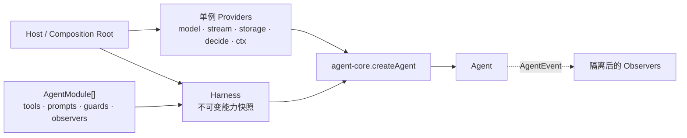

# harness

> 目标包：`packages/harness` — Agent 能力的静态组合层。
> 本包已实现；本文描述当前静态组合契约。
> `agent-core.md` 仍是 Agent 运行语义的唯一来源，本文不重新定义 Loop、Session、Decision 或 Tool。

---

## 1. 结论

Nova **适合增加 `harness` 层**，但只适合做一件事：

> 把一组可信的、进程启动时已知的能力贡献，确定性地组合成可供 `agent-core` 使用的 Agent 配置。

它不是新的 Agent Runtime，也不是通用插件框架。

当前 `agent-core` 已经提供真实运行时：Turn Loop、Tool Batch、Session、Decision、队列、上下文生命周期和 Sub-agent。未来会出现多个装配入口：

- `agent-server` 为每个 conversation 创建 Agent；
- 集成测试创建真实 Runner + Agent；
- CLI / SDK 可能在本机创建 Agent 进程，但所有 FS / OS / Shell 操作仍由 Remote Runner 执行；
- Coding 场景需要稳定地装入 Coding Prompt 与代码工具；
- 其他场景可能装入不同的工具和 Prompt。

如果每个入口都直接拼 `tools`、`systemPrompt`、`hooks` 和订阅器，能力集合会逐渐分叉。`harness` 解决的是这个已经可识别的变化点，而不是为未知插件预建基础设施。

---

## 2. 定位

**负责**

- 定义轻量的 `AgentModule` 数据契约；
- 按调用方给定顺序合并 Tool、Prompt、Guard、Observer；
- 在创建 Agent 前校验 module id、tool name、prompt name 唯一；
- 将多个 Tool Guard 合成为只会收紧权限的 `beforeToolCall`；
- 将 Observer 接到 `AgentEvent`，隔离 Observer 自身异常；
- 固化一份不可变的能力快照，供同一 Host 创建多个 Agent。

**不负责**

| 不负责 | 归属 |
|---|---|
| Turn Loop、Tool Batch、Session、Decision、队列 | `agent-core` |
| Tool 的执行语义 | Tool 自身 / `packages/tools` |
| 模型 Provider 选择与重试 | Host / `model-adapters` |
| Runner 连接、Registry、Workspace 选择 | Host / `runner-sdk` / Runner Module |
| `SessionStorage`、`Decide` 的实现；通过 runner-sdk 创建 `ToolContext` | Host |
| HTTP、SSE、鉴权、数据库 | `agent-server` |
| npm 包发现、动态 import、热加载、卸载 | 不做，见 §10 |
| 第三方代码隔离、权限沙箱、签名与供应链安全 | 不做，见 §9 |

`harness` 依赖 `agent-core`，但 `agent-core` **不得反向依赖** `harness`。

---

## 3. 为什么不是 Plugin Framework

DeepSeek Harness 的插件体系解决的是大规模能力包、服务发现、生命周期和动态组合问题。Nova 当前没有这些规模与运行时需求，照搬会立即引入：

- Service Registry / DI Container；
- provider / consumer / capability 等多套抽象；
- 插件依赖图、优先级和加载状态；
- 动态卸载时的并发、Session 与资源回收语义；
- 第三方权限与版本兼容协议。

Nova 当前真正需要的是**内部可信模块的静态组合**。因此第一版采用普通 TypeScript 数据结构和函数，不建立 `PluginManager`、`PluginHost`、`ServiceContainer`、装饰器或反射机制。

名字叫 `harness`，不代表所有东西都必须成为 Plugin。

---

## 4. 概念模型



这里有两类不同的变化点：

| 类型 | 数量语义 | 例子 | 处理方式 |
|---|---|---|---|
| Contribution | 可以有多个 | Tool、Prompt、Guard、Observer | Module 贡献并合并 |
| Provider | 每个 Agent 恰好一个 | Stream、Storage、Decide、ToolContext | Host 显式注入 |

Provider 不做成 Module。它们通常拥有连接、凭据、取消信号或持久化资源，且必须明确唯一 owner。把 Provider 放进模块集合会把“选择一个实现”变成隐式覆盖。

对于带 Workspace Tool 的 Agent，Host 注入的 `ToolContext` 必须来自 `runner-sdk.toToolContext(RunnerSession, ...)`。Harness 不提供 Local ToolContext，也不在 Runner 不可用时降级到 Node.js 本地 FS / Shell。

---

## 5. 对外 API 面

第一版只需要以下公开面：

```ts
import type {
  Agent,
  AgentConfig,
  AgentEvent,
  AgentHooks,
  AgentTool,
  PromptAsset,
  Risk,
  ToolCall,
} from "@nova/agent-core"

export interface AgentModule {
  readonly id: string
  readonly tools?: readonly AgentTool[]
  readonly prompts?: readonly PromptAsset[]
  readonly guards?: readonly ToolGuard[]
  readonly observers?: readonly AgentObserver[]
}

export type ToolGuard = (
  call: ToolCall & { risk: Risk },
  signal: AbortSignal,
) => Promise<"ask" | "deny" | undefined>

export type AgentObserver = (event: AgentEvent) => void | Promise<void>

export interface HarnessConfig {
  modules: readonly AgentModule[]
  onGuardError?: (error: unknown, moduleId: string) => void
  onObserverError?: (error: unknown, moduleId: string) => void
}

export type HarnessAgentConfig = Omit<
  AgentConfig,
  "tools" | "systemPrompt" | "hooks"
> & {
  systemPrompt?: readonly PromptAsset[]
  hooks?: Omit<AgentHooks, "beforeToolCall">
}

export interface Harness {
  createAgent(config: HarnessAgentConfig): Agent
  readonly moduleIds: readonly string[]
  readonly toolNames: readonly string[]
}

export function createHarness(config: HarnessConfig): Harness
```

不导出 Resolver、Registry 或内部聚合结果。调用方只需知道装了哪些 module / tool，并通过 `Agent` 的既有 API 运行和观测。

### 5.1 为什么 `Harness` 可以创建 Agent

如果 `createHarness()` 每次只把参数原样转给 `createAgent()`，它就是应删除的 pass-through wrapper。

它成立的前提是：

1. Module 在 Harness 创建时只解析和校验一次；
2. 解析结果成为不可变能力快照；
3. 每个 Agent 只注入自己的 Provider 和 Session 参数；
4. Guard 合成与 Observer 隔离只在这里实现一次。

同一个 `agent-server` 进程可以复用一份 Coding Harness，为多个 conversation 创建 Agent，而不会在每次请求中重新发现或改变能力集合。

如果实现时只有一个调用点、一个 module，并且不存在上述职责，**暂不创建该包**，直接在 Composition Root 中局部组合。

---

## 6. Module 合并规则

Module 数组的顺序就是唯一顺序来源，不增加 `priority`、`before`、`after` 或依赖图。

```ts
const harness = createHarness({
  modules: [baseModule, codingAgentModule, companyPolicyModule],
})
```

合并时必须满足：

| 项 | 规则 |
|---|---|
| module id | 全局唯一；重复立即抛错 |
| tool name | 全局唯一；不允许后者静默覆盖前者 |
| prompt name | 全局唯一；不允许同名覆盖 |
| prompt 顺序 | 先 module 数组顺序，再 module 内数组顺序，最后是 Agent 实例额外 Prompt |
| guard 顺序 | 保留注册顺序，但最终决策满足单调规则，见 §7 |
| observer 顺序 | 保留注册顺序；不得依赖其他 Observer 的副作用 |
| module 内容 | 解析后冻结；Agent 运行期间不可增删 |

Tool 与 Prompt 冲突 fail-fast，比“最后注册者获胜”更安全。后者会让 module 顺序意外改变权限和模型行为。

第一版不支持 module 声明依赖。内部模块由 Composition Root 显式排序已经足够；只有出现大量独立发布模块且手工排序无法维护时，才重新评估依赖图。

---

## 7. Tool Guard

Guard 用于叠加组织策略、场景策略或额外审批要求。它不是权限放宽接口。

### 7.1 单调合成

```text
任意 guard 返回 deny  → deny
否则任意 guard 返回 ask → ask
否则                       → 不改变 agent-core 的基础审批策略
```

`ToolGuard` 故意没有 `"allow"`。Module 可以收紧策略，不能把 `agent-core` 或 Host 的 `deny` 改为 `auto`。

永久放行仍走 `DecisionResponse.allow_always` 和 Session allowlist；基础规则仍由 `ApprovalPolicy` 决定。

### 7.2 失败语义

Guard 抛错按 `deny` 处理，并交给 `onGuardError` 记录。安全决策必须 fail-closed，不能因扩展代码故障而放行写入或执行。

### 7.3 与现有 `AgentHooks` 的关系

Harness 把多个 Guard 合成为一个 `AgentHooks.beforeToolCall`。其他 Hook：

- `afterToolCall` 的只读观测应优先改用 Observer；
- `shouldStopAfterTurn`、`prepareNextTurn` 仍是 `agent-core` 的高级策略面；
- 第一版 Module 不贡献这两个 Hook，避免多个模块争夺 model / thinkingLevel / activeTools 的唯一写权限。

若未来确实出现多个 Turn 策略，先确定状态 owner 和冲突规则，再扩展 Module；不能直接把整个 `AgentHooks[]` 暴露出来。

现有 `AgentHooks.beforeToolCall(call)` 在 Harness 实施时需要做一个最小兼容扩展：

```ts
beforeToolCall?(
  call: ToolCall & { risk: Risk },
  signal: AbortSignal,
): Promise<"allow" | "ask" | "deny">
```

JavaScript 会忽略新增实参，已有只接收 `call` 的 Hook 不受影响。`signal` 让异步 Guard 随 Agent abort 收敛；`risk` 避免 Harness 根据 Tool 名再次查表。

同时必须修正当前 `agent.ts` 中的策略合成：注释写着 Hook “不能越过 deny”，但现有 `"allow"` 分支会把基础 `deny` 改成 `auto`。至少应保证基础 `deny` 不可被任何 Hook 放宽。Harness 自身不暴露 `"allow"`，因此 Module 始终满足单调规则。

---

## 8. Observer

Observer 只观察 `AgentEvent`，不得改变 Agent 状态、阻塞 Loop 或参与 Decision。

典型用途：

- telemetry；
- 调试日志；
- usage 统计；
- Host 内部的只读指标投影。

规则：

1. Harness 独立调用每个 Observer，并捕获同步异常与 Promise rejection；
2. 一个 Observer 失败不影响其他 Observer，也不终止 Agent；
3. `onObserverError` 只用于日志 / 指标，不能回调 Agent；
4. 需要可靠持久化的事实必须进入 `SessionStorage` 的 Record，不依赖 Observer；
5. Observer 不拥有并发队列。若上报目标很慢，由具体 Observer 自己做有界缓冲，但不得把 backpressure 传给 Agent Loop。

Observer 不是事件驱动业务框架。关键控制流仍保持在 `agent-core` 的显式调用链中。

---

## 9. 第三方扩展的升级路径

内部静态 Module 不等于可以安全加载第三方代码。

只有出现“用户安装独立发布的第三方能力包”这一真实需求后，才在 **Host 外围** 增加加载层：

```ts
interface ModuleManifest {
  id: string
  version: string
  apiVersion: string
  entry: string
  permissions: string[]
}
```

加载层完成版本检查、来源校验、权限声明和 import，最终仍产出同一个 `AgentModule`。`agent-core` 与 Harness 的合并语义不变。

第三方阶段必须同时设计：

- API 兼容版本；
- npm / 文件来源与完整性校验；
- Tool 权限与凭据隔离；
- Module 配置 schema；
- 敏感数据可见范围；
- 故障隔离与审计。

在这些问题没有答案前，不允许把任意路径交给 `import()` 并称为插件系统。

---

## 10. 运行时动态插件为什么推迟

Agent 运行中安装 / 卸载 Module 会同时改变模型可见 Tool Schema、Prompt、审批策略和恢复语义。要正确支持，至少需要：

- 只在 Turn 边界提交变更；
- 每个 Session 持久化能力快照版本；
- 正在执行的 Tool drain 完成后才能卸载；
- mount handle 与幂等 disposer；
- Sub-agent 的继承规则；
- Resume 时可重建原能力集合；
- 并发变更的唯一 owner。

当前没有该需求，因此第一版 Harness 创建后不可变。新增能力通过新建 Harness / Agent 生效，不热更新正在运行的 Agent。

---

## 11. Host 装配

```ts
import { createHarness } from "@nova/harness"
import { codingAgentModule } from "@nova/coding-agent"

const codingHarness = createHarness({
  modules: [codingAgentModule],
  onObserverError: (error, moduleId) => logger.warn({ error, moduleId }),
})

function createConversationAgent(conv, project, userId) {
  const ctx = project
    ? toToolContext(registry.pick(userId, project.workspace), {
        cwd: project.workspace,
        signal,
      })
    : undefined

  return codingHarness.createAgent({
    model: resolveModelRef(conv),
    stream: createModelStream(conv),
    ctx,
    storage: pgSessionStorage(db, conv.id),
    decide: sseDecide(conv.id),
    userId,
  })
}
```

上例中的 Runner 选择、Storage、Decide、模型和用户仍由 `agent-server` 决定。Harness 没有取代 Composition Root，只把可复用的能力集合从 Host 中抽出来。

Chat 与 Project 仍不建两个 Runtime 类。没有 `ctx` 时，`agent-core` 的现有构造期校验会拒绝包含 `risk !== "none"` 的 Coding 工具。若产品需要独立通用 Chat，应使用不含 Coding Module 的另一份 Harness，而不是在 Coding Module 内写模式分支。

---

## 12. Sub-agent 规则

Sub-agent 由 `agent-core` 创建，Harness 不接管其生命周期。

能力继承保持现有语义：

- 子 Agent 继承父 Agent 创建时的不可变能力快照；
- `spawn_agent.tools` 只能缩小 Tool 集合，不能新增 Tool；
- 子 Agent 不能卸载 Guard，也不能降低审批策略；
- 子 Agent 不安装新 Module；
- 深度、并发和 token 预算 owner 仍是 `agent-core`。

第一版不把 module id 写入 Session。静态能力由部署配置决定；只有 Session 之间可能使用不同 Module 版本、且 Resume 必须精确重建旧版本时，才增加持久化快照。

---

## 13. 目录结构

实现时预计最多需要：

```text
packages/harness/
├── src/
│   ├── index.ts
│   ├── types.ts          # AgentModule / ToolGuard / AgentObserver
│   ├── resolve.ts        # 确定性合并、重复校验、Guard 合成
│   └── harness.ts        # createHarness，复用不可变解析结果创建 Agent
├── package.json
└── tsconfig.json
```

如果 `resolve.ts` 与 `harness.ts` 实现都很短，应合并为一个文件。禁止为了匹配本目录图而制造文件。

不创建：

```text
plugin-manager/
service-container/
registry/
lifecycle/
loader/
capabilities/
```

---

## 14. 测试契约

Harness 单元测试只测组合行为：

1. Module、Tool、Prompt 重名时 fail-fast；
2. Tool 与 Prompt 顺序稳定；
3. `deny > ask > unchanged`，且 Module 无法放宽基础策略；
4. Guard 抛错时 deny；
5. Observer 抛错不影响 Agent 和其他 Observer；
6. 多个 Agent 复用同一 Harness 时能力快照不被修改；
7. Agent 实例附加 Prompt 排在 Module Prompt 之后；
8. 没有 `ctx` 时装入 Coding 工具仍由 `agent-core` 早失败。

集成测试还要证明：`agent-server` 与 `packages/coding-agent/test` 使用同一 Module 集合时，得到相同的 Tool 名单与 Prompt 顺序。

测试文件 `packages/coding-agent/test/test-runtime.ts` 是测试装配根，不是本包 API；不保留第二个同名 `createHarness`。

---

## 15. 实施条件与顺序

满足以下条件再实现 `packages/harness`：

1. 至少两个真实 Composition Root 需要复用同一能力集合；或
2. `coding-agent` 与另一类 Agent Profile 已经需要不同的 Tool / Prompt / Guard 组合。

建议顺序：

1. 先补 Harness 的组合测试；
2. 实现静态 Module 解析与校验；
3. 实现 `createHarness()`，内部直接调用现有 `createAgent()`；
4. 增加 `coding-agent` Module；
5. 将 agent-server 与集成测试改为使用同一 Module；
6. 删除原 Composition Root 中重复的 Tool / Prompt 拼装；
7. 更新 `repo-layout.md`、`README.md` 与依赖图。

实施后必须检查：没有 `PluginManager`、没有 pass-through Adapter、没有两套 Tool Registry、没有重复 Prompt、没有旧的默认 Tool profile 直装兼容路径。

---

## 16. Phase 范围

| 阶段 | 内容 |
|---|---|
| 第一版 | 内部可信 Module；静态组合；Tool / Prompt / Guard / Observer；不可变快照 |
| 有真实第三方需求后 | Host 外围 Manifest Loader、版本与权限模型，仍产出 `AgentModule` |
| 有真实热加载需求后 | Turn 边界事务、Session 快照版本、drain / dispose / resume 语义 |

**明确不做**：Cordis 式容器、Everything-is-a-Plugin、动态 Service Registry、运行时依赖图、自动扫描目录、装饰器注册、跨进程插件协议。
