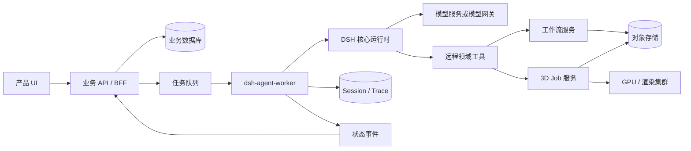

# DeepSeek Harness 在线 Server Agent 轻量组装方案

> 2026-09-11 实施说明：本文保留原始架构参考，以下代码片段不是 `@nnova/dsh-agent` 的公共 API。已落地接口见 [README](./README.md)：`createDshAgentKernel → createAgent → send/compact/cancel/dispose`。模型密钥直接通过 `apiKey` 传入；会话独立持有 Context，内核管理配置和并发额度。未实现本文描述的 Worker、队列、租约及持久化。已完成千问 Anthropic 兼容接口的真实多轮、工具与压缩验证。

## Summary

本文采用一个明确方案：业务系统直接使用 DeepSeek Harness 核心包，在独立 `dsh-agent-worker` 进程中组装自己的 Harness，不启动 `dsh` CLI，不加载 profile、bundle 或 SDK stdio Server。Worker 只注册受控的远程领域工具；低代码编译、工作流发布和 3D/GPU 生成均由外部业务服务执行。

这个入口不属于仓库当前声明的受支持 Node 应用启动方式。团队需要固定整组 DSH 版本，通过自有适配层隔离预稳定 API，并用装配、回放和安全契约测试承担升级兼容性。

## Table of Contents

- [采用结论](#采用结论)
- [总体架构](#总体架构)
- [内核边界](#内核边界)
- [项目结构](#项目结构)
- [依赖与版本](#依赖与版本)
- [组装运行时](#组装运行时)
- [创建和驱动 Agent](#创建和驱动-agent)
- [接入其他模型](#接入其他模型)
- [实现远程业务工具](#实现远程业务工具)
- [会话与任务生命周期](#会话与任务生命周期)
- [多租户与安全](#多租户与安全)
- [升级策略](#升级策略)
- [实施顺序](#实施顺序)
- [已知限制](#已知限制)

---

## 采用结论

DeepSeek Harness 适合作为在线业务 Agent 的编排内核，但不应同时承担公网 API、多租户鉴权、业务数据存储或 3D 渲染。采用范围是模型调用、Agent Loop、Session 事件、Prompt 组装和 Tool 调度。

推荐部署单元是独立 Worker，而不是把 Harness 直接嵌入 API/BFF 进程。Worker 在进程内挂载 DSH 核心插件，一个 Worker 可以顺序处理多个运行，也可以按租户或安全域建立暖池。初期应限制单 Worker 并发，直到模型适配器、业务工具和 Session Provider 都通过并发隔离测试。

| 决策                 | 选择                                          |
| -------------------- | --------------------------------------------- |
| 应用入口             | 自有 `dsh-agent-worker`                       |
| DSH 启动方式         | 直接创建 Cordis `Context` 并挂载核心包        |
| CLI、profile、bundle | 不使用                                        |
| SDK stdio JSON-RPC   | 不使用                                        |
| Agent 创建           | `ctx.agents.create()`，每个运行独立作用域     |
| 模型接入             | `dsh-llm-pi-ai` 或自定义 `LlmAdapter`         |
| Vercel AI SDK        | 不需要；仅可作为自定义 Adapter 的内部实现     |
| Tool                 | 只注册远程领域操作，不注册本地执行工具        |
| 3D 生成              | Tool 提交异步 Job，GPU 服务负责实际生成       |
| 业务状态             | 业务数据库为事实源，Session 仅保存 Agent 轨迹 |

仓库测试采用相同的核心装配方式创建运行时，见 [`/submodule/deepseek-harness/packages/core/agent-loop/tests/agent.spec.ts`](../../submodule/deepseek-harness/packages/core/agent-loop/tests/agent.spec.ts)。`AgentRegistry.create()` 还提供运行级 `setup` 和受所有者控制的 `dispose()`，更适合 Server 调用，见 [`/submodule/deepseek-harness/packages/core/agent/src/index.ts`](../../submodule/deepseek-harness/packages/core/agent/src/index.ts)。

---

## 总体架构



业务 API 负责登录、租户鉴权、额度、审计、项目权限和前端协议。任务队列负责削峰、重试、租约和 Worker 调度。Harness Worker 负责模型交互和领域工具编排。远程服务负责所有有副作用的业务操作，并再次校验调用身份、资源版本和幂等键。

不要让模型直接连接数据库、对象存储主密钥、Docker Socket、Kubernetes API 或任意 URL。模型只能看到业务语义明确、参数受限、结果结构化的领域工具。

---

## 内核边界

### 必需能力

| 职责             | 包                                                      |
| ---------------- | ------------------------------------------------------- |
| Cordis 生命周期  | `@deepseek-ai/cordis`                                   |
| 模型注册和调用   | `@deepseek-ai/dsh-llm`                                  |
| 内存 Session     | `@deepseek-ai/dsh-session`                              |
| Session 派生状态 | `@deepseek-ai/dsh-session-projection`                   |
| System Prompt    | `@deepseek-ai/dsh-system-prompt`                        |
| Tool 注册和执行  | `@deepseek-ai/dsh-tools`                                |
| Agent 注册与循环 | `@deepseek-ai/dsh-agent`、`@deepseek-ai/dsh-agent-loop` |

再按部署选择一个模型 Adapter。多模型部署优先使用 `@deepseek-ai/dsh-llm-pi-ai`；仅调用 DeepSeek 官方服务时可以使用 `@deepseek-ai/dsh-llm-deepseek`。

### 明确排除

- `dsh-base`、CLI、profile loader 和 bundle loader。
- `dsh-sdk-app`、`dsh-sdk-jsonrpc-server` 和 stdio 协议层。
- Shell、PowerShell、PTY、subprocess、Jobs 和本地文件工具。
- PTC Code Runtime、Skills、自修改、Subagent、Ralph 和本地 Workflow Worker。
- 通用 Web Search、任意 URL fetch 和面向终端的交互组件。
- Harness Web API、Web UI 和本地工作区管理能力。

不挂载这些插件比“加载后禁用”更容易审计。运行级 Tool allow-list 和执行 guard 仍需保留，以防公司自己的装配发生变化。

---

## 项目结构

推荐把 DSH 相关代码限制在一个适配包中：

```text
apps/
  api-server/
  dsh-agent-worker/
packages/
  dsh-agent/
    src/runtime.ts
    src/run-agent.ts
    src/model-adapter.ts
    src/event-mapper.ts
    src/business-tools.ts
    src/contracts.ts
  workflow-client/
  model3d-client/
```

`api-server` 不直接依赖任何 `@deepseek-ai/dsh-*` 包。`dsh-agent` 对外提供稳定的公司接口，只有该包可以导入 DSH 类型。`workflow-client` 和 `model3d-client` 是普通受鉴权 HTTP/gRPC 客户端，不依赖 Agent 框架。

建议对外接口保持简单：

```typescript
export interface DSHAgent {
  run(request: AgentRunRequest): Promise<AgentRunResult>;
  cancel(runId: string): Promise<void>;
  dispose(): Promise<void>;
}
```

前端和业务服务不应直接消费 DSH Session Event。`event-mapper.ts` 把它们转换成公司稳定事件，例如 `run.started`、`assistant.delta`、`tool.started`、`artifact.ready` 和 `run.finished`。

---

## 依赖与版本

当前源码快照是 `0.1.5-rc.2`。所有 DSH 包必须使用同一个精确版本，不使用 `^`、`~` 或混合版本。

```json
{
  "name": "@your-company/dsh-agent",
  "private": true,
  "type": "module",
  "engines": {
    "node": "^22.19.0 || >=24.0.0"
  },
  "dependencies": {
    "@deepseek-ai/cordis": "4.0.2",
    "@deepseek-ai/dsh-agent": "0.1.5-rc.2",
    "@deepseek-ai/dsh-agent-loop": "0.1.5-rc.2",
    "@deepseek-ai/dsh-llm": "0.1.5-rc.2",
    "@deepseek-ai/dsh-llm-pi-ai": "0.1.5-rc.2",
    "@deepseek-ai/dsh-session": "0.1.5-rc.2",
    "@deepseek-ai/dsh-session-projection": "0.1.5-rc.2",
    "@deepseek-ai/dsh-system-prompt": "0.1.5-rc.2",
    "@deepseek-ai/dsh-tools": "0.1.5-rc.2"
  }
}
```

实际安装时还需要满足所选 Adapter 声明的 peer dependencies。应由包管理器锁文件记录完整解析结果，不要依赖运行环境临时安装依赖。

无持久化需求时，Session 可以只存在于内存中。需要跨进程恢复时再增加 `SessionPersistence` Provider；默认 JSONL Provider 更适合单机或归档型运行，大规模在线部署应提供满足 Session 持久化契约的数据库或对象存储实现。

---

## 组装运行时

Worker 启动时创建一个根 `Context`，按依赖顺序挂载核心插件和模型 Adapter。队列中的每个任务通过同一根运行时创建一个独立 Agent 作用域。

```typescript
import { Context } from "@deepseek-ai/cordis";
import AgentRegistry from "@deepseek-ai/dsh-agent";
import AgentLoop from "@deepseek-ai/dsh-agent-loop";
import LlmRuntime from "@deepseek-ai/dsh-llm";
import * as LlmPiAi from "@deepseek-ai/dsh-llm-pi-ai";
import SessionStore from "@deepseek-ai/dsh-session";
import SessionProjectionRegistry from "@deepseek-ai/dsh-session-projection";
import SystemPrompt from "@deepseek-ai/dsh-system-prompt";
import ToolRuntime from "@deepseek-ai/dsh-tools";

export async function createRuntime() {
  const ctx = new Context();

  await ctx.plugin(LlmRuntime);
  await ctx.plugin(SessionStore);
  await ctx.plugin(SessionProjectionRegistry);
  await ctx.plugin(SystemPrompt, {
    includeHarnessIdentity: false,
    includeRuntimeContext: false,
    personaPrefix: "Generate validated workflows and coordinate remote 3D jobs.",
  });
  await ctx.plugin(ToolRuntime, { mode: "native", maxParallelSubCalls: 1 });
  await ctx.plugin(AgentRegistry);
  await ctx.plugin(AgentLoop, { agents: [] });

  await ctx.plugin(LlmPiAi, {
    providers: {
      internal: {
        displayName: "Internal LLM Gateway",
        apiKeyEnv: "INTERNAL_LLM_API_KEY",
        api: "openai-completions",
        baseURL: "https://llm.example.com/v1",
        models: [{ id: "agent-model", contextWindow: 131072, maxTokens: 16384 }],
      },
    },
  });

  return { ctx, dispose: () => ctx.fiber.dispose() };
}
```

这段代码是装配模板，域名、模型容量、认证来源和 Prompt 必须由部署配置提供。密钥只能来自 Worker 的受信环境或凭据服务，不能出现在任务消息、Tool 参数、Session Event 或日志中。

Worker 收到关闭信号后应停止领取任务，取消或等待当前运行，释放所有 AgentHandle，再调用一次根 `ctx.fiber.dispose()`。API 服务不应复用或直接操作根 Context。

---

## 创建和驱动 Agent

每个运行使用 `ctx.agents.create()`。它在 Agent 发布前执行 `setup`，因此可以按租户注册作用域工具和策略；返回的 `AgentHandle` 明确拥有销毁能力。

```typescript
import { createUserMessage } from "@deepseek-ai/dsh-llm";
import { SessionId } from "@deepseek-ai/dsh-session";

export async function runAgent(ctx, request) {
  const handle = await ctx.agents.create({
    sessionId: SessionId(request.runId),
    agentOptions: {
      provider: request.modelRoute.provider,
      model: request.modelRoute.model,
    },
    setup(agentCtx) {
      registerBusinessTools(agentCtx, request.identity);
      agentCtx.tools.guard((execution) =>
        execution.name.startsWith("workflow_") || execution.name.startsWith("model3d_")
          ? undefined
          : "This worker permits only approved business tools.",
      );
    },
  });

  try {
    handle.agent.followup(
      createUserMessage({
        content: [{ type: "text", text: request.prompt }],
        source: { kind: "user" },
      }),
    );
    await handle.agent.whenIdle();
    return mapSessionToResult(handle.agent.session);
  } finally {
    await handle.dispose();
  }
}
```

生产实现还要把运行加入 `runId → AgentHandle` 的内存表，使取消请求可以找到对应 Agent。取消是协作式的：模型 Adapter 和每个 Tool 都必须监听传入的 `AbortSignal`。超过运行级截止时间后，Worker 应先请求取消；无法在宽限期内收敛时，由 Orchestrator 回收整个 Worker 进程。

---

## 接入其他模型

DSH 的 Agent Loop 不绑定 DeepSeek。`LlmRuntime` 根据 `provider` 路由到通过 `ctx.llm.registerAdapter()` 注册的 `LlmAdapter`，具体契约见 [`packages/llm/llm/src/index.ts`](packages/llm/llm/src/index.ts)。

`@deepseek-ai/dsh-llm-pi-ai` 可以连接多个 pi-ai 目录提供商、OpenAI-compatible 网关和自托管服务。手工声明的路由可使用 `openai-completions`、`openai-responses` 或 `anthropic-messages`。配置和限制见 [`packages/llm/llm-pi-ai/README.zh.md`](packages/llm/llm-pi-ai/README.zh.md)。

同一个 Worker 可以注册多个路由，例如 `openai`、`anthropic` 和 `internal`。Orchestrator 根据场景、租户套餐、模型健康度和成本选择 `provider + model`，不要让最终用户提交未经允许的任意 Provider、模型 ID 或 Base URL。

本方案不需要 Vercel AI SDK。DSH 自带的多模型 Adapter 依赖 `@earendil-works/pi-ai`，它不是 Vercel 的 `ai` 或 `@ai-sdk/*`。

当企业模型层已经基于 Vercel AI SDK，或者 `llm-pi-ai` 无法支持目标协议时，可以实现一个自定义 `LlmAdapter`，在其内部使用 AI SDK。AI SDK 只负责模型传输和流事件转换；Agent Loop、Tool Loop、Session、上下文和重试只能由一层拥有，避免两个 Agent 框架同时推进同一轮对话。

自定义 Adapter 至少需要正确处理流式文本、推理块、Tool Call、结束原因、用量、错误归一化、取消信号和模型能力。只有确实需要特殊协议时才承担这项维护成本。

---

## 实现远程业务工具

工具实现捕获服务端身份并调用远程服务。`tenantId`、`userId`、`projectId`、内部令牌和回调地址不能成为模型可填写的参数。

```typescript
import { defineTool } from "@deepseek-ai/dsh-tools";

function registerBusinessTools(agentCtx, identity) {
  agentCtx.tools.register(
    defineTool({
      name: "model3d_submit_job",
      description: "Submit a validated asynchronous 3D generation job.",
      parameters: {
        prompt: { type: "string", required: true },
        idempotencyKey: { type: "string", required: true },
      },
      output: {
        schema: {
          type: "object",
          properties: { jobId: { type: "string" }, status: { type: "string" } },
          required: ["jobId", "status"],
        },
        render: (_args, value) => [{ type: "text", text: JSON.stringify(value) }],
      },
      async execute(args, execution) {
        return model3dClient.submit({
          ...identity,
          prompt: args.prompt,
          idempotencyKey: args.idempotencyKey,
          signal: execution.signal,
        });
      },
    }),
  );
}
```

低代码工具建议使用 `workflow_get_capabilities`、`workflow_validate_draft`、`workflow_create_draft`、`workflow_apply_patch`、`workflow_compile` 和 `workflow_request_publish`。工作流服务负责节点白名单、表达式限制、循环上限、连接权限、乐观锁和发布审批。

3D 工具建议使用 `model3d_submit_job`、`model3d_get_job`、`model3d_cancel_job`、`model3d_list_artifacts` 和 `model3d_select_artifact`。提交工具必须快速返回 `jobId`，不能在一次 Tool Call 内等待 GPU 生成。模型文件和大 JSON 存入对象存储，Session 只记录对象 ID、摘要、缩略图信息和受控下载引用。

所有写工具都需要幂等键，更新工具需要 `expectedVersion`。删除、覆盖、付费生成和发布采用“生成草稿或计划 → 策略审批或用户确认 → 执行”的两阶段流程。

---

## 会话与任务生命周期

业务数据库保存 `runId`、租户、用户、项目、状态、模型路由、内核版本、输入摘要、计费信息、输出引用和错误码。它是在线查询和恢复的事实源。

Harness Session 保存消息、步骤、Tool Call 和模型输出，适合调试、审计与回放。Session 不代替工作流、项目、3D Job 或权限数据。大型内容只保存引用。

```text
queued -> leased -> running -> succeeded
                           -> failed
                           -> cancelled
                           -> timed_out
```

队列重投时使用同一个 `runId` 和业务幂等键。恢复 Session 前，Orchestrator 必须取得单写者租约；两个 Worker 不能同时写同一个 Session。无法保证安全恢复时，应创建新的尝试 Session，并在业务表中关联原运行。

---

## 多租户与安全

一个 Cordis 根 Context 内的插件是受信代码，不构成进程级安全边界。不同租户的 Tool 作用域可以逻辑隔离，但无法防止恶意或错误插件访问同一进程资源。

- Agent 的租户身份来自队列签名消息或 Worker 租约，不来自 Prompt 和 Tool 参数。
- 每次下游调用使用短期、最小权限、绑定租户和运行的服务令牌。
- 模型路由、Base URL、Tool 名称和 Tool Schema 都由服务端 allow-list 决定。
- Worker 使用非 root 用户、只读镜像、资源限制、运行截止时间和网络出口白名单。
- Worker 镜像不包含 Shell 工具插件、云平台管理凭据、Docker Socket 或包管理写权限。
- Tool 服务再次执行鉴权、幂等、资源归属和输入校验；Harness guard 不是最终授权层。
- 日志过滤密钥、Authorization Header、签名 URL 和供应商原始错误体。
- 高价值租户或互不信任插件使用独立 Worker 进程或容器。

---

## 升级策略

直接装配使用的是预稳定核心 API。享受上游升级的关键不是复制源码，而是保持一个薄适配层和可重复验证流程。

- 所有 `@deepseek-ai/dsh-*` 包使用相同的精确版本并一次升级。
- `@deepseek-ai/cordis` 使用该 DSH 版本实际声明和测试的版本。
- 锁文件和生产镜像不可变；运行时不解析 `latest` 或安装新包。
- 业务代码只能依赖公司的 `DSHAgent` 接口，不能散布 DSH 类型。

| 检查           | 阻止发布的条件                                         |
| -------------- | ------------------------------------------------------ |
| 装配启动       | 根 Context 无法完整挂载和释放                          |
| 类型契约       | `dsh-agent` 不能通过 TypeScript 编译                   |
| Tool 目录      | 实际可见工具不等于审核后的 allow-list                  |
| 执行策略       | 非 allow-list Tool 可以到达 executor                   |
| Agent 生命周期 | 完成、失败、取消或超时后仍有 Agent、连接或定时器存活   |
| 模型转换       | 文本、Tool Call、用量、结束原因或错误无法稳定映射      |
| Session 回放   | 固定历史无法重建相同的模型输入和业务结果               |
| 租户隔离       | 身份来自模型参数，或令牌可以越权访问其他租户           |
| 旧运行处理     | 新 Worker 不能按部署策略读取、恢复或明确拒绝旧 Session |

升级流程是在独立分支中整体更新 DSH 版本，重新生成锁文件，执行上述门禁，再用真实模型完成低代码与 3D 关键路径 canary。保留上一版 Worker 镜像；回滚只切换新任务，不让两个版本同时写同一个 Session。

---

## 实施顺序

1. 建立 `dsh-agent` 和独立 Worker，只挂载内存 Session、一个模型路由和一个只读业务 Tool。
2. 完成单轮、多轮、Tool Call、取消、超时和根 Context 释放测试。
3. 接入队列和业务运行表，使用一个幂等写工具打通低代码草稿或 3D Job 提交。
4. 增加运行级 Tool guard、下游短期令牌、容器资源限制和网络出口白名单。
5. 建立 Session 归档、固定响应回放、真实模型 canary 和整组依赖升级流水线。
6. 通过并发与故障注入后，再决定每运行一个 Worker、每租户暖池或共享 Worker 的密度。

最小生产闭环是“业务 API → 队列 → 独立 Worker → DSH 核心 → 远程领域工具 → 业务数据库/对象存储”。不要把 CLI、profile、stdio SDK、本地执行工具或 GPU 执行器带回这个边界。

---

## 已知限制

- 仓库的应用启动规则只支持具名 `dsh` profile；本文的直接嵌入入口由采用方自行支持。
- DSH 公共 API 处于 pre-stable 阶段，包升级可能需要修改适配层。
- 同进程插件都是受信代码，Tool 作用域不是恶意代码隔离机制。
- 默认 Session 持久化不是完整的云端多租户数据库方案。
- 模型供应商对 Tool Calling、推理内容、图片、缓存和取消的行为不完全一致，必须按实际模型建立兼容测试。
- 长耗时 3D 任务需要外部状态机和事件唤醒；Agent Loop 不应持有数分钟的 Tool Call。

## Dev Note

本文代码是基于当前源码 API 的组装模板。当前工作区未安装依赖，模板尚未作为独立消费项目完成构建和真实模型请求验证；落地仓库应把编译、运行时启动、Tool allow-list 和端到端模型测试设为首批门禁。
